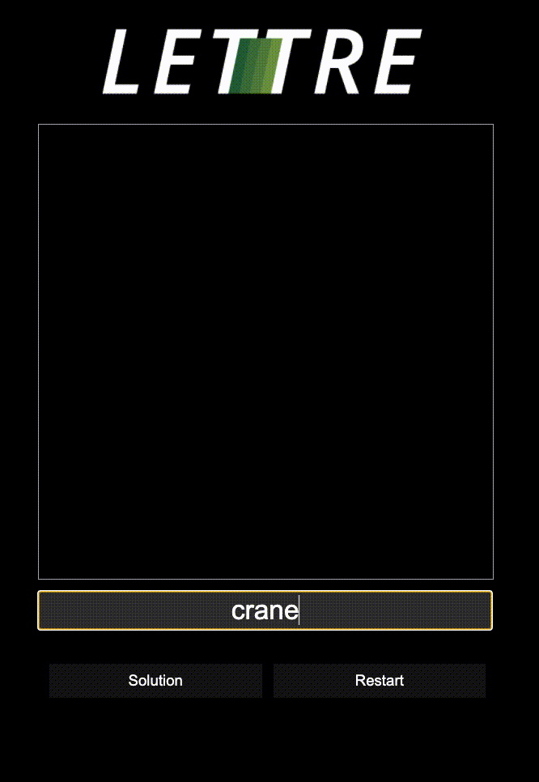

# opdracht

Maak een simpele "wordle" app. Je kan beginnen van de volgende classroom link.

Er worden een aantal functies gegeven, en we hebben de JSON file reeds voor jou geimporteerd in de "wordString" variabele, je zal deze zelf moeten omzetten in een object.
Je kan functie per functie verder werken tot het eindresultaat. 

Om het jezelf gemakkelijk te maken, begin je misschien best met de "oplossing tonen" knop (#solution).

Hieronder even de functionaliteiten van de verschillende functies:

* pickRandomWord: kies een random woord uit de lijst van woorden die reeds geimporteerd is
* matchWord: controlleer of de letters die de user heeft ingegeven op de juiste plaats staan, of ergens in het woord zitten
* addGuess: render het ingegeven woord van de user in de lijst met antwoorden, met de juiste kleuren
  - In de HTML staat een div ("row") met hierin de voorbeelden van de letters. 
  - Vergeet de div "row" zelf niet aan te maken
* Showsolution: maak de oplossing zichtbaar voor de gebruiker
* reset: begin opnieuw, kies een nieuw woord en maak de oplossing onzichtbaar

Bovenaan de opdracht staan een aantal functies die je misschien nodig kan hebben doorheen het process. Je behoort deze zelf even op te zoeken.